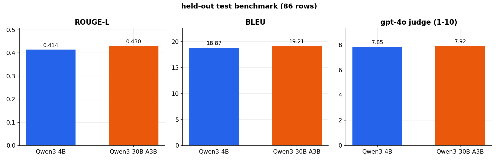
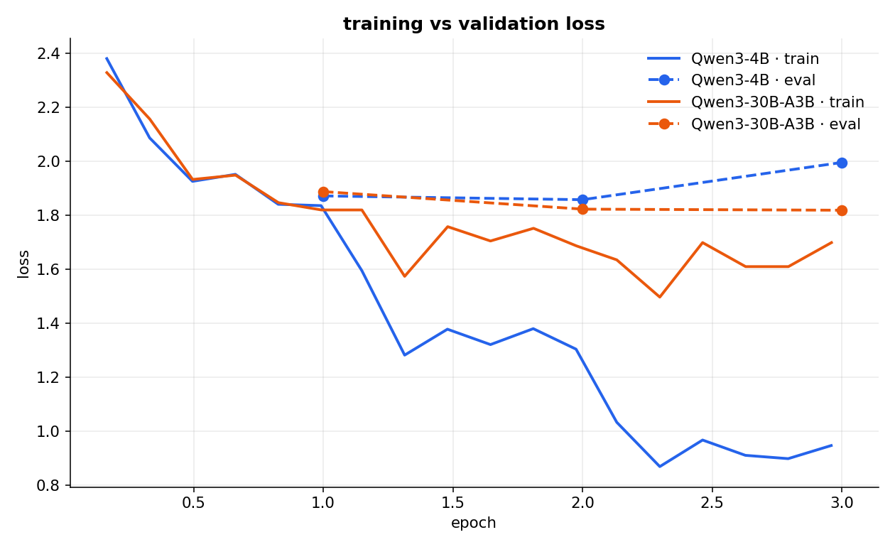
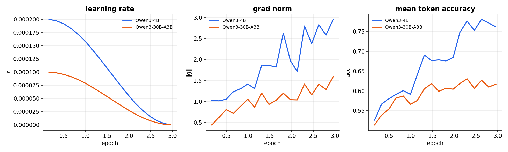

# qwen3_tweet_style

teaching two Qwen3 base models to draft X/Twitter posts in my own voice, by
fine-tuning them on [🤗 `Pradheep1647/tweet-style-dataset`](https://huggingface.co/datasets/Pradheep1647/tweet-style-dataset)
(967 train / 85 val / 86 test, `instruction` → `response`).

| model | base | adapter |
|---|---|---|
| 4B  | `Qwen/Qwen3-4B-Base`       | [](https://huggingface.co/Pradheep1647/qwen3-tweet-style-4b) |
| 30B-A3B | `Qwen/Qwen3-30B-A3B-Base`  | [](https://huggingface.co/Pradheep1647/qwen3-tweet-style-30b-a3b) |

> there is no `Qwen3-32B-Base` on the hub (qwen3's dense base models stop at 14B),
> so the big slot uses `Qwen3-30B-A3B-Base` — a 30B moe base, ~3B active per token.

## the point

this is the **SFT warm-up**, not the main event — it just teaches the base models
the `instruction → response` format and my voice, giving on-policy distillation a
sane starting policy to improve from. the OPD work builds on these adapters.

the only SFT details that bit:

- **4B → QLoRA** (4-bit nf4 base + bf16 lora).
- **30B-A3B → bf16 LoRA on attention only** — bitsandbytes can't quantize the moe's
  fused experts (loads ~61GB bf16 regardless), so qlora buys nothing; adapting just
  the attention keeps it under one 80GB gpu.

trained on a rented A100 80GB (prime intellect): 4B ~7 min, 30B-A3B ~46 min.

## setup

```bash
cd qwen3_tweet_style
uv sync
```

## train (TUI)

```bash
uv run python tui.py
```

asks once for **HF username**, **HF token**, and **OpenRouter API key**, then gives
a menu to train the 4B or 30B (auto-pushes the adapter to the hub) or run the
benchmark. everything the child process prints is streamed live and appended to
`training.log`.

run a script directly if you'd rather:

```bash
HF_USERNAME=... HF_TOKEN=... uv run python train_qwen3_4b.py --push
```

## benchmark

```bash
OPENROUTER_API_KEY=... HF_USERNAME=... uv run python eval_benchmark.py
```

scores both models on the held-out `test` split three ways, in full bf16 precision:

- **ROUGE-L** and **BLEU** against the reference tweet — cheap n-gram overlap, a
  rough proxy since style isn't really an exact-match problem.
- **COMET** ([`Unbabel/wmt22-comet-da`](https://huggingface.co/Unbabel/wmt22-comet-da)) — a
  learned xlm-r metric scoring semantic match (src = instruction, mt = generated tweet,
  ref = reference), less brittle than n-gram overlap. `--no-comet` to skip.
- **LLM-as-judge** — an OpenRouter model (`openai/gpt-4o` by default,
  `--judge-model` to swap) rates 1–10 how well the generated tweet matches the
  reference in voice/tone. this is the metric that actually captures "does it sound
  like me". ([judging LLMs with LLMs, Zheng et al., 2023](https://arxiv.org/abs/2306.05685))

`--limit N` for a quick pass, `--no-judge` to skip the API calls.

## results

greedy decoding on all 86 test rows, judge = `openai/gpt-4o`.

| model | ROUGE-L | BLEU | judge (1–10) |
|---|---|---|---|
| Qwen3-4B tweet-style       | 0.4137 | 18.87 | 7.85 |
| Qwen3-30B-A3B tweet-style  | **0.4304** | **19.21** | **7.92** |



the 30B-A3B is a bit ahead on all three, but the gap is small — the 4B already
picks up the voice well, and for a short-form style task it's the more practical
model to actually serve.

## on-policy distillation (the main event)

with the SFT adapters as a warm start, the 4B student is pushed further by **on-policy
(speculative) knowledge distillation** ([SKD, arXiv:2410.11325](https://arxiv.org/abs/2410.11325))
with **verl** — distilling from the trained **Qwen3-30B-A3B** as the teacher. the student
rolls out tweets on-policy via sglang, the frozen 30B scores top-k logprobs over each
rollout, and a token-level **forward-KL** (top-k, K=25) pulls the student toward the teacher.
verl 0.8 ships this natively (`distillation.enabled`, `loss_mode=forward_kl_topk`); the run
uses the trained models, not base — nothing is trained from scratch.

pipeline (runs on a 2× A100 80GB pod — 30B teacher on one gpu, 4B student on the other):

```bash
# 0. synthetic prompts (deepseek-v4-flash via openrouter), prompts-only — student
#    self-generates the tweets on-policy, so no reference targets are needed.
OPENROUTER_API_KEY=... HF_USERNAME=... uv run python gen_opd_prompts.py --target 1500 --push

# 1. merge the trained adapters into full models (teacher served + student init), stamping
#    the exact SFT chat template so verl's rollout prompt matches the warm-up format.
uv run python merge_adapter.py --base Qwen/Qwen3-4B-Base \
  --adapter Pradheep1647/qwen3-tweet-style-4b --out checkpoints/qwen3-4b-sft-merged
uv run python merge_adapter.py --base Qwen/Qwen3-30B-A3B-Base \
  --adapter Pradheep1647/qwen3-tweet-style-30b-a3b --out checkpoints/qwen3-30b-a3b-sft-merged

# 2. build verl parquet (prompts as one user message; verl applies the SFT template)
uv run python prepare_opd_data.py --jsonl data/opd_prompts.jsonl

# 3. distill (verl, forward_kl_topk K=25). uv sync --extra opd first for verl[sglang].
uv run --extra opd bash scripts/train_opd_4b.sh
```

the distilled adapter is merged into the warm-started 4B and pushed as a full model,
`Pradheep1647/qwen3-tweet-style-4b-opd` (🤗), which `eval_benchmark.py` scores alongside the
SFT models. success = the OPD 4B beats the SFT 4B judge (7.85), ideally closing toward the
30B teacher (7.92).

## training curves



the 4B's train loss dives toward ~1.0 while its eval loss bottoms out at epoch 2 and
ticks back up at epoch 3 — mild overfitting on a tiny dataset. the 30B-A3B's eval
loss keeps drifting down (1.89 → 1.82 → 1.82), so it generalises a little better.
one epoch (or some early stopping) would probably be the sweet spot for the 4B.



the 4B (higher lr, smaller model) pushes token accuracy and grad norm up faster —
the same eagerness that shows up as overfitting above.

curves are parsed straight from the trainer logs:

```bash
uv run python plot_curves.py \
  --log "Qwen3-4B=artifacts/train_4b.log" \
  --log "Qwen3-30B-A3B=artifacts/train_30b_a3b.log"
```
