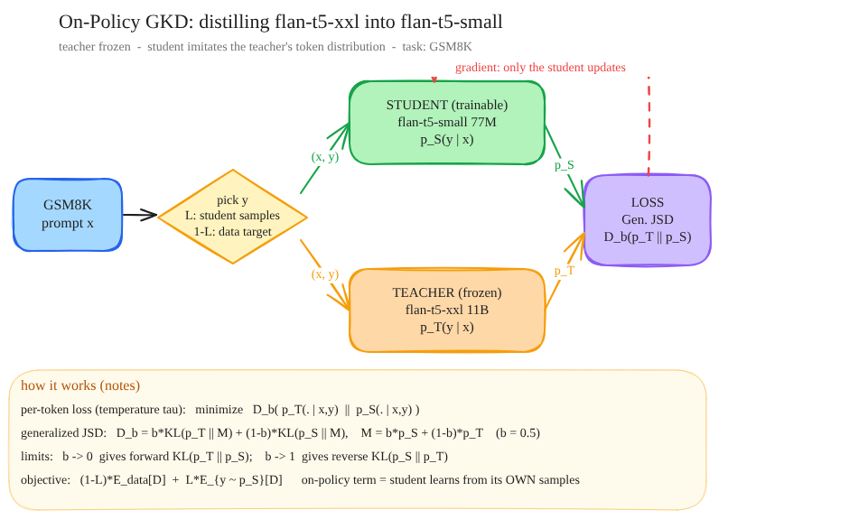
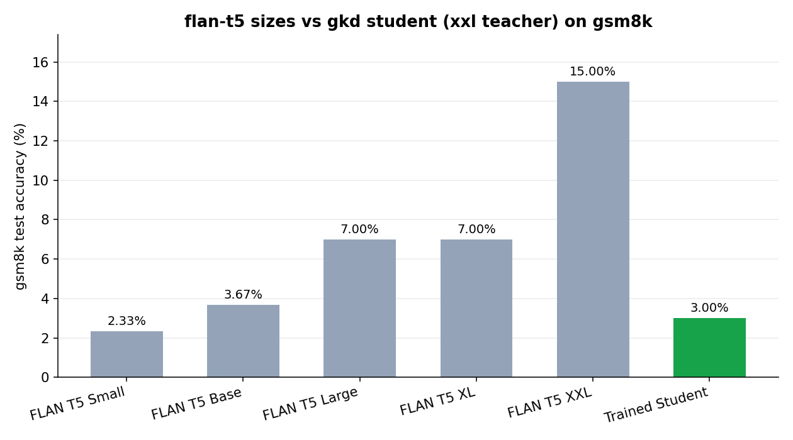
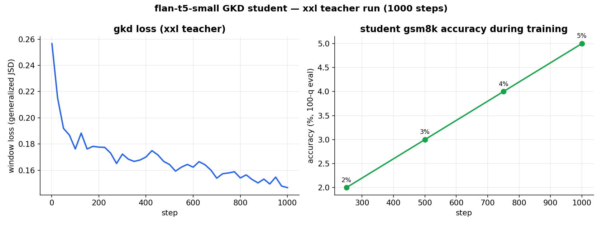
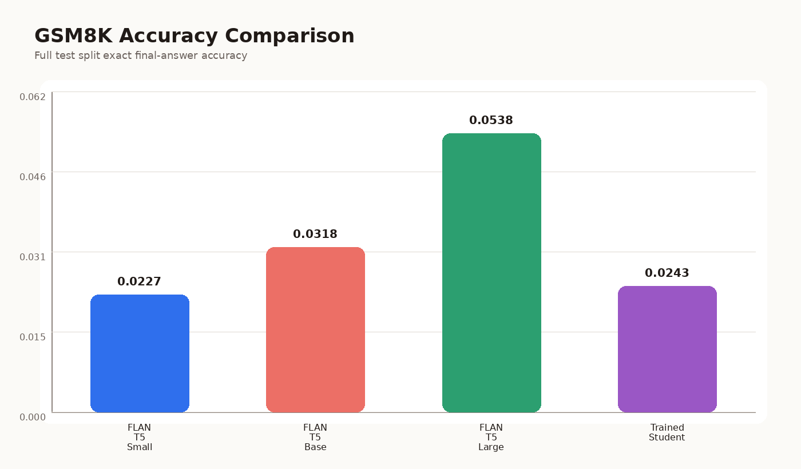
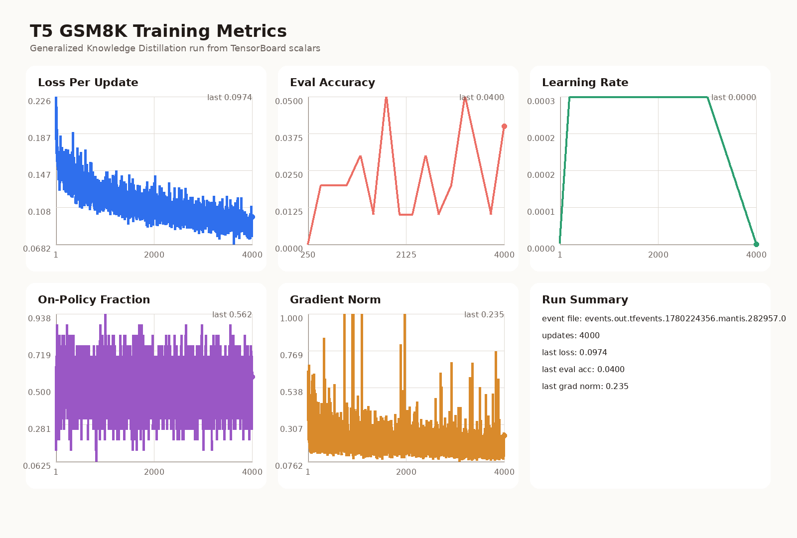

# t5 gkd on gsm8k

[](https://huggingface.co/Pradheep1647/flan-t5-small-gsm8k-gkd-xxl-teacher)
[](https://huggingface.co/Pradheep1647/flan-t5-small-gsm8k-77m-gkd-jsd-lr3e4-b16-u4k-lam05-beta05)

generalised knowledge distillation (GKD, [Agarwal et al., 2023](https://arxiv.org/abs/2306.13649))
on the [🤗 gsm8k](https://huggingface.co/datasets/openai/gsm8k) math-reasoning dataset: distill a big
**[🤗 flan-t5-xxl](https://huggingface.co/google/flan-t5-xxl) (11B)** teacher into a
tiny **[🤗 flan-t5-small](https://huggingface.co/google/flan-t5-small) (77M)** student, and measure how far the student climbs.

teacher and student share the same flan-t5 vocabulary, so the divergence is computed over the
*full* per-token distribution (not just the sampled token) — that is what makes this real GKD
rather than hard-label distillation.

## the process



Each step takes a prompt `x`, picks a completion `y`, scores it under **both** models, and pushes
the student's distribution toward the teacher's. The teacher is frozen — only the student learns.

The one knob that makes GKD different from vanilla KD is **where `y` comes from**:

- **off-policy (supervised):** `y` is a fixed target from the dataset.
- **on-policy:** `y` is sampled from the *student itself*, then scored by the teacher.

Training on the student's own samples closes the train/inference mismatch (exposure bias): the
student is corrected on exactly the kind of text it will produce at generation time.

## the objective

Let $p_T$ and $p_S$ be the teacher and student token distributions (at temperature $\tau$). GKD
minimises a divergence $\mathcal{D}$ between them, averaged over a mix of fixed data and
on-policy samples with mixing fraction $\lambda$:

$$
\mathcal{L}(\theta) = (1-\lambda)\, \mathbb{E}_{(x,y)\sim \mathcal{D}_{\text{data}}}\big[\mathcal{D}(p_T \Vert p_S)(y\mid x)\big] \;+\; \lambda\, \mathbb{E}_{x\sim \mathcal{D}_{\text{data}}}\, \mathbb{E}_{y\sim p_S(\cdot\mid x)}\big[\mathcal{D}(p_T \Vert p_S)(y\mid x)\big]
$$

The divergence itself is the **generalized Jensen–Shannon divergence** with interpolation
$\beta$, using the mixture $M = \beta\, p_S + (1-\beta)\, p_T$:

$$
\mathcal{D}_{\beta}(p_T \Vert p_S) = \beta\, D_{\mathrm{KL}}(p_T \Vert M) \;+\; (1-\beta)\, D_{\mathrm{KL}}(p_S \Vert M)
$$

with the two informative limits

$$
\beta \to 0:\; D_{\mathrm{KL}}(p_T \Vert p_S) \quad\text{(forward KL, mode-covering)} \qquad
\beta \to 1:\; D_{\mathrm{KL}}(p_S \Vert p_T) \quad\text{(reverse KL, mode-seeking)}
$$

This run used $\beta = 0.5$ (symmetric JSD) and $\lambda = 0.5$. The implementation is in
`train_laptop_t5_gkd.py` (`generalized_jsd_loss`, `compute_gkd_loss`).

## results

GSM8K test accuracy (exact-match on the final number). Two runs, distinguished by **teacher**:

| model | **previous run** (large teacher) | **this run** (xxl teacher) |
|---|---|---|
| [🤗 flan-t5-small](https://huggingface.co/google/flan-t5-small) (baseline) | 0.0227 | 0.0233 |
| [🤗 flan-t5-base](https://huggingface.co/google/flan-t5-base) | 0.0318 | 0.0367 |
| [🤗 flan-t5-large](https://huggingface.co/google/flan-t5-large) | 0.0538 | 0.0700 |
| [🤗 flan-t5-xl](https://huggingface.co/google/flan-t5-xl) | — | 0.0700 |
| [🤗 flan-t5-xxl](https://huggingface.co/google/flan-t5-xxl) | — | **0.1500** |
| **[🤗 trained student](https://huggingface.co/Pradheep1647/flan-t5-small-gsm8k-gkd-xxl-teacher)** (small) | 0.0243 | **0.0300** |

> caveat: the two columns aren't a perfectly controlled A/B. the previous run was the full
> 1319-question test set in fp32; this run is a 300-question subset in bf16 (the xxl teacher made
> the full sweep too slow). so compare *within* a column (student vs its small baseline), and read
> the cross-column trend as directional.



### training curves (xxl-teacher run)



the generalized-JSD loss falls steadily as the cosine LR decays, and the student's in-training
accuracy (on a 100-question eval slice) climbs monotonically **2% → 3% → 4% → 5%** and is *still
rising at step 1000* — so this short run is under-trained, not converged. headline number is the
300-question benchmark (3.00%); the 100-q slice is just noisier.

### reading the graphs together

- **size scaling is real and steep on the teacher side:** large 7% → xxl **15%**. doubling-ish the
  teacher's capability roughly doubled its gsm8k accuracy.
- **the student moves, but only a little:** it sits down near the small/base baselines, far below
  its teacher. a 77M model simply doesn't have the capacity to absorb an 11B model's reasoning.

## what upgrading the teacher bought

The interesting comparison is the student's lift *over its own small baseline*:

| teacher | student | small baseline | absolute lift | relative lift |
|---|---|---|---|---|
| flan-t5-large (770M) | 0.0243 | 0.0227 | +0.0016 | +7% |
| flan-t5-xxl (11B)    | 0.0300 | 0.0233 | +0.0067 | +29% |

Same student, same recipe, same step budget — **only the teacher changed**, and the relative gain
over baseline went from ~7% to ~29% (~4×). So a stronger teacher gives a strictly richer training
signal. But the *absolute* ceiling is set by the student: 3% is still nowhere near the teacher's
15%, because distillation transfers a distribution the student has to be big enough to represent.
This is the classic **capacity gap** in distillation.

### why the student barely moves

so why does the little 77m student basically refuse to climb, even when i hand it an 11b teacher?

honestly it comes down to: the student is too small to hold what the teacher knows. swapping in a
smarter teacher gives it a *better target*, but not the room to actually represent that target. you
can see it in the run — the loss keeps dropping (the student does get better at mimicking the
teacher token-by-token), but gsm8k is graded on the final number after a whole chain of arithmetic.
get one token in that chain wrong and the answer is wrong. so "slightly better imitation" shows up
as a 0.2-0.7% accuracy bump instead of a real jump. the teacher got smarter; the student just
doesn't have the parameters to follow it that far. a bigger student (or more steps — this run was
under-trained) is the real lever, not an even bigger teacher.

<details>
<summary><b>open for the technical explanation</b></summary>

<br>

a few things stack up here:

- **capacity / expressivity bound.** GKD minimises $\mathbb{E}\,[\mathcal{D}(p_T \Vert p_S)]$, but
  the student's hypothesis space is tiny (77M params). there's a floor on how small that divergence
  can get — the student literally cannot place its probability mass where an 11B teacher does. a
  better teacher lowers the *target* but the student's attainable minimum is set by its own size, so
  most of the extra teacher quality is unreachable.

- **token-level objective vs sequence-level metric.** the loss is per-token; gsm8k accuracy is
  exact-match on the final answer after an $L$-token reasoning chain. even with high per-token
  agreement $p$, full-chain correctness scales roughly like $p^{L}$ — errors compound. so big drops
  in token loss translate into only small moves in end-to-end accuracy.

- **mode-covering vs mode-seeking.** at $\beta = 0.5$ the JSD sits between forward KL
  ($D_{\mathrm{KL}}(p_T \Vert p_S)$, mode-covering — student spreads mass to cover every teacher mode,
  which for an under-capacity model means blurrier, hedged distributions and shakier greedy decodes)
  and reverse KL (mode-seeking). neither escapes the capacity wall; they just change *how* the limited
  mass gets allocated.

- **on-policy ≠ more capacity.** the on-policy term ($\lambda$ fraction) fixes exposure bias —
  training the student on its *own* samples so it's corrected on the text it'll actually generate.
  great for distribution match, but it adds zero representational capacity, so it can't close the gap
  either.

- **what would actually move it:** a larger student (flan-t5-base/large), a longer schedule (the
  accuracy was still rising at step 1000), or stacking the orthogonal axis — test-time scaling like
  self-consistency over the distilled student at eval.

</details>

## compute scaling: where this experiment sits

It's worth being precise about *which* compute-scaling axis this is, because the term gets
overloaded:

- **train-time / teacher (distillation) scaling — what we did.** Spend more compute on the
  *teacher* that generates the training signal. A bigger teacher has a sharper, better-calibrated
  per-token distribution, so the student imitates a better target. This is the axis explored by
  distillation scaling laws — student quality improves with teacher capability, bounded by student
  capacity.
- **test-time / inference-time scaling — *not* what we did (the orthogonal axis).** Take a *fixed*
  model and spend more compute *per query at inference* to get better answers: longer
  chain-of-thought, self-consistency (sample many CoTs and majority-vote), best-of-N with a
  verifier, or search. Here the weights don't change; you trade inference FLOPs for accuracy.

These are complementary. Our lever moved the *training target* (teacher scaling); it did **not**
give the student any extra inference-time budget. A natural follow-up would be to stack the
orthogonal axis on top — e.g. self-consistency over the distilled student at eval — which is a
test-time-scaling move, not a distillation one.

## scripts

- `train_laptop_t5_gkd.py` — the GKD trainer used here. local hf teacher (bf16), on-policy + supervised mix, generalized-JSD loss, tensorboard logging, optional `--push-to-hub`.
- `eval_compare.py` — benchmarks flan-t5 small→xxl and the trained student on gsm8k (`--include-xl --include-xxl`), writes `--results-out` json.
- `plot_training_metrics.py` — older tensorboard-based plot helper.
- `train.py` / `teacher_inference.py` — the remote-API teacher variant (decoder-only teacher over fastapi); not used for this run.

## reproduce

```bash
uv sync

# train the student (flan-t5-xxl teacher, bf16) and push
uv run python train_laptop_t5_gkd.py \
  --training-steps 1000 --warmup-steps 80 --cooldown-begin 700 --cooldown-end 1000 \
  --push-to-hub --hub-repo-id <user>/flan-t5-small-gsm8k-gkd-xxl-teacher --hub-token <hf_token>

# benchmark every size + the student
uv run python eval_compare.py --include-xl --include-xxl --limit 300 \
  --results-out artifacts/gsm8k_results.json
```

xxl is an 11B model (~22GB bf16) — it needs a ~40GB+ GPU both as the teacher during training and
as the largest model in the eval. this run used a single L40S 48GB.

### previous run (large teacher) — kept for reference



